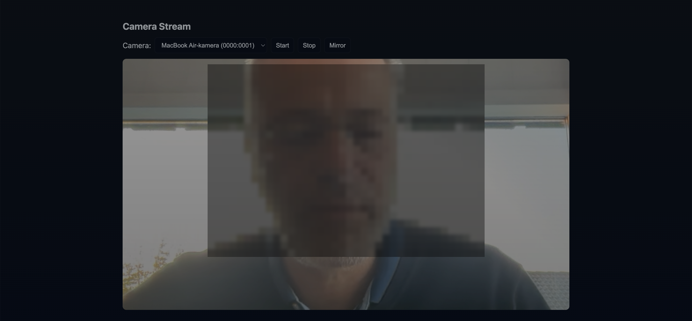

# Camera Stream

Simple project that serves an HTML page showing the device camera stream using navigator.mediaDevices.getUserMedia.

Made as a learning-project with Github copilot.

Prerequisites
- Node.js (>=14)

Install and run

```bash
npm install
npm start
```

Open http://localhost:3000 in a browser and allow camera access. On mobile devices, open the same URL using the device's browser or use tunneling (ngrok) if needed.

Notes
- The page lists available video input devices and lets you switch between them.
- If camera permissions are denied, the page will show an error message.

Files
 - `index.html` — The main HTML page. Contains the UI (video element, device selector and control buttons).
 - `styles.css` — Styling for the page and the video viewer. Also defines the `.mirrored` class used to flip the video horizontally.
 - `main.js` — Frontend logic: enumerates video input devices, requests camera access with `navigator.mediaDevices.getUserMedia`, starts/stops the stream, handles errors, and implements the Mirror toggle (state persisted in `localStorage`).
 - `server.js` — A minimal Express server that serves the static files on port 3000. You can run it with `node server.js` or using the `npm start` script.
 - `package.json` — Project manifest with metadata and the `start` script. Lists `express` as a dependency for the server.
 - `.github/copilot-instructions.md` — Workspace-specific helper used by tooling (created by the workspace scaffold).

Quick verification
1. Install dependencies (if you want to use the Express server):

```bash
npm install
npm start
```

2. Or for a quick static test without Node.js, from the project root run:

```bash
python3 -m http.server 3000
```

Then open `http://localhost:3000` in your browser and allow camera access. Use the "Mirror" button to toggle horizontal flip.

Screenshot



Using the Python fallback (when `npm`/Node.js is not available)

If you don't have Node.js or `npm` installed, you can still test the frontend quickly using Python's built-in HTTP server. This serves the static files (HTML/CSS/JS) which is sufficient for testing `getUserMedia` on `localhost`.

From the project root run:

```bash
python3 -m http.server 3000
```

Then open `http://localhost:3000` in your browser. Note:
- This only serves static files; `server.js` will not be used.
- Camera access typically works on `localhost` without HTTPS. For testing from a different device (mobile), you'll need to use a tunnel (ngrok) or run the server on the device itself.

